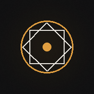

# OBSCURA

> A dark, cinematic portfolio for a **graphic designer + photographer** — built as a
> full-stack Next.js **PWA** with immersive **React Three Fiber** 3D.



## What's inside

- **Floating-photograph hero** — photographic prints drifting in dark space with dust
  particles, mouse parallax, scroll-driven camera dolly, and cinematic post-processing
  (bloom · chromatic aberration · vignette).
- **Draggable 3D gallery** (`/work`) — a rotating ring of framed photos with inertia,
  hover-to-inspect, contact shadows, and a live caption that tracks the front-most piece.
- **Full-stack contact form** — posts to a Next.js Route Handler that validates input and
  saves an `Inquiry` to the database through Prisma.
- **Installable PWA** — manifest, maskable icons, offline service worker.
- **Cinematic UI** — film-grain + vignette overlays, a custom cursor, Lenis smooth
  scrolling, Framer-Motion reveals, and an editorial type system.

## Tech stack

| Layer | Choice |
| --- | --- |
| Framework | **Next.js 14** (App Router) + **TypeScript** |
| 3D | **three** · **@react-three/fiber** · **@react-three/drei** · **@react-three/postprocessing** |
| Styling | **Tailwind CSS** (CSS-variable design tokens, dark theme) |
| Motion | **Framer Motion** + **Lenis** (smooth scroll) |
| Backend | Next.js Route Handlers + **Prisma** |
| Database | **SQLite** in dev (swap to PostgreSQL for prod — one line) |
| PWA | **@ducanh2912/next-pwa** |
| Fonts | Fraunces · Hanken Grotesk · JetBrains Mono (`next/font`) |

## Structure

```
app/
  layout.tsx            # fonts, metadata, global chrome (cursor, scroll, nav, footer, grain)
  page.tsx              # home: 3D hero + studio + work + services
  work/page.tsx         # 3D gallery + project index
  contact/page.tsx      # contact form page
  not-found.tsx         # 404
  api/contact/route.ts  # POST -> Prisma (save inquiry), GET -> count
  globals.css           # design tokens + film grain + cursor + helpers
components/
  three/
    HeroScene.tsx        HeroCanvas.tsx       # floating-photo hero (dynamic, ssr:false)
    GalleryScene.tsx     GalleryCanvas.tsx    # draggable 3D ring (dynamic, ssr:false)
  Nav · Footer · Cursor · SmoothScroll · Reveal · Marquee
  WorkPreview · WorkGallery · ContactForm
lib/
  db.ts                 # Prisma client singleton
  projects.ts           # your projects (edit me)
  utils.ts
prisma/schema.prisma    # Inquiry model (SQLite)
public/
  manifest.json · icons/ · photos/   # swap photos for your work
scripts/gen_assets.py   # regenerates icons + placeholder photography
```

## Quick start

```bash
npm install
npx prisma db push
npm run dev
```

See **setup.md** for full instructions, customization, and the PostgreSQL switch.

---

*Placeholder imagery and the "OBSCURA" brand are stand-ins — drop in your own photos
(`public/photos/`), edit `lib/projects.ts`, and rename to taste.*
